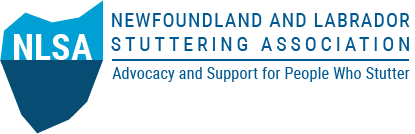
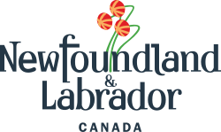

 
# An Invitation to Join

Researchers in the [Department of Linguistics](https://www.mun.ca/linguistics/) at Memorial University of Newfoundland, in partnership with the [Newfoundland and Labrador Stuttering Association](http://nlstuttering.ca), are launching a new province-wide initiative called Accessibility and Inclusion for People Who Stutter. It focuses on community engagement, service accessibility, and collaborative research.

The project seeks to better understand how social, educational, and health-care systems in Newfoundland and Labrador support—or unintentionally create barriers - across the lifespans of people who stutter. The work brings together researchers, people who stutter, family members, educators, speech-language pathologists, health professionals, community organizations, and policy stakeholders to build a shared community of practice around communication accessibility.

The project includes:

- A province-wide survey on access to services  

- Community meetings and workshops in multiple regions  

- Interviews with stakeholders  

- Knowledge-mobilization through public events and multimedia outreach (the “Some Stutter, Luh!” podcast)  

The team is inviting collaborators and community partners from across Memorial and beyond, including faculty, students, service providers, advocacy organizations, and policy professionals who are interested in accessible communication, disability justice, and community-engaged research.

Ethics approval has been granted by Memorial’s Interdisciplinary Committee on Ethics in Human Research. 

Faculty, staff, students, and community professionals interested in learning more or exploring opportunities for collaboration are invited to contact Dr. Paul De Decker, [pauldd@mun.ca](mailto:pauldd@mun.ca "mailto:pauldd@mun.ca") or the NL Stuttering Association, [info@nlstuttering.ca](mailto:info@nlstuttering.ca "mailto:info@nlstuttering.ca")
